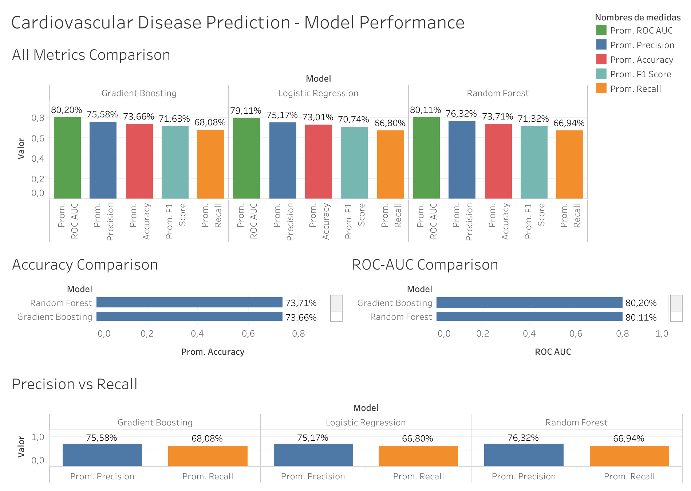
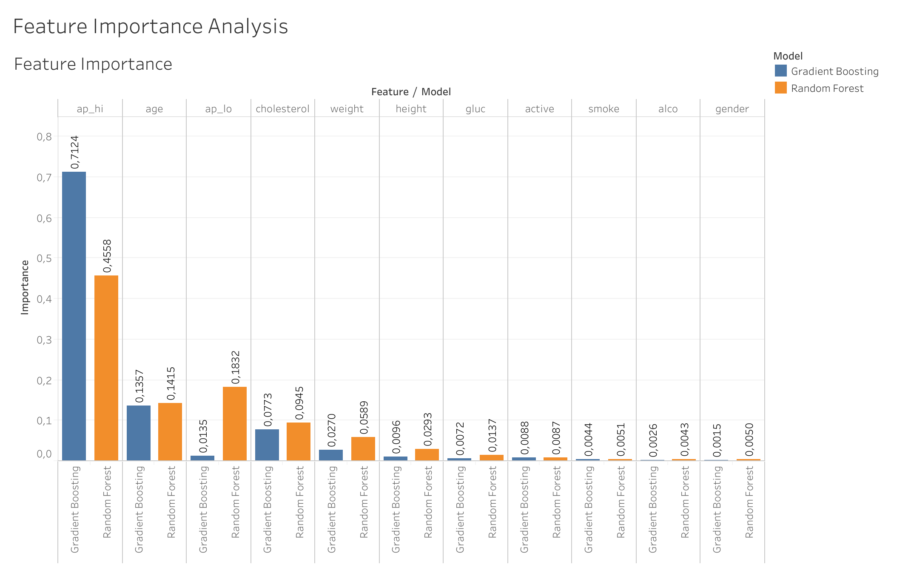
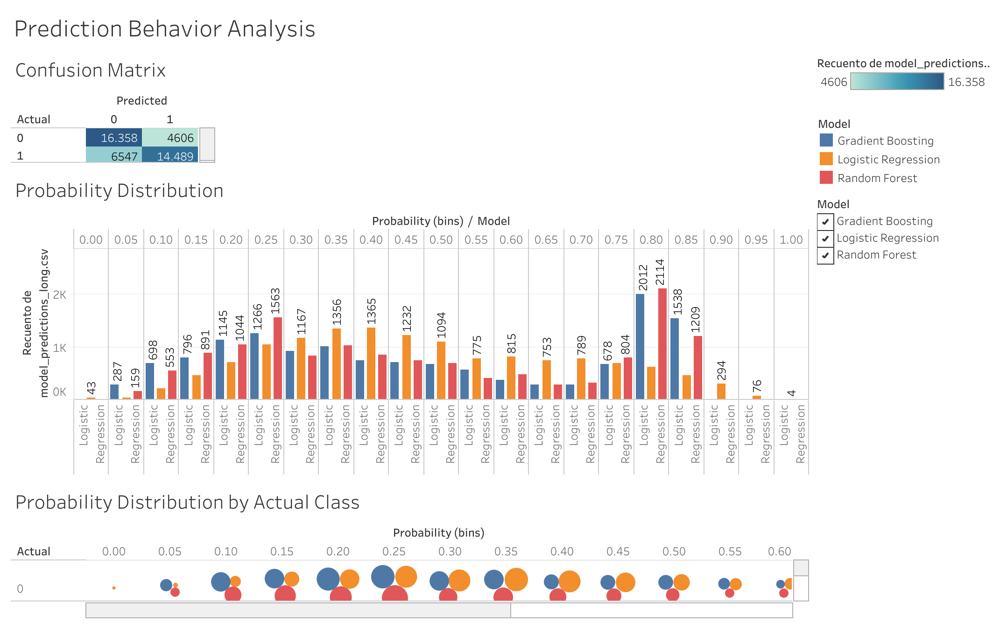

# Cardiovascular Disease Prediction using Machine Learning

## Overview

This project applies machine learning techniques to predict the presence of a cardiovascular disease in a patient. 

The project includes:

* Data exploration and preprocessing
* Baseline model training
* Feature engineering
* Model retraining with engineered features
* Model comparison using multiple evaluation metrics
* Feature importance analysis

Three machine learning models were evaluated:

* Logistic Regression
* Random Forest
* Gradient Boosting

---

## Project Goal

The objective of this project is to evaluate how different machine learning models perform in predicting cardiovascular disease risk and to identify which health indicators are most influential in the prediction.

---

## Dataset

This project uses the **Cardiovascular Disease Dataset** available on Kaggle.

Due to licensing restrictions, the dataset is **not included in this repository**. Instead, it must be downloaded directly from Kaggle.

Dataset source:

https://www.kaggle.com/datasets/sulianova/cardiovascular-disease-dataset

### Downloading the dataset

You can download the dataset using the Kaggle CLI:

```bash
!pip install kaggle

# Set your Kaggle API credentials (replace with your own)
!export KAGGLE_USERNAME="your_username"
!export KAGGLE_KEY="your_key"

# Download dataset
!kaggle datasets download sulianova/cardiovascular-disease-dataset

# Unzip dataset
!unzip cardiovascular-disease-dataset.zip
```

To use this command, you must configure your Kaggle API credentials by setting them as mentioned.

---

## Project Structure

```
Cardiovascular-Disease-Prediction/
│
├── notebooks/
│   └── Cardiovascular_Disease_Prediction.ipynb
│
├── tableau/
│   └── cardiovascular_disease_prediction.twbx
│
├── data/
│   ├── model_comparison_metrics.csv
│   ├── feature_importance.csv
│   ├── rf_feature_importance.csv
│   ├── gb_feature_importance.csv
│   ├── model_predictions_long.csv
│   └── model_predictions.csv
│
├── images/
│   ├── model_performance_dashboard.png
│   ├── model_explainability_dashboard.png
│   └── prediction_analysis_dashboard.png
│
│
├── README.md
└── LICENSE

cardiovascular-disease-ml/
│
├── images/
│   ├── model_performance_dashboard.png
│   ├── model_explainability_dashboard.png
│   └── prediction_analysis_dashboard.png
│
├── notebooks/
│   └── cardiovascular_ml.ipynb
│
├── data/
│   ├── model_comparison_metrics.csv
│   ├── feature_importance.csv
│   └── model_predictions.csv
│
└── README.md
```

---

## Notebook Structure

The notebook follows a structured machine learning workflow:

1. **Data Loading**
   Importing the dataset and preparing it for analysis.

2. **Data Exploration**
   Examining feature distributions, correlations, and potential issues in the dataset.

3. **Data Cleaning and Wrangling**
   Preparing the dataset for machine learning, including handling column formats and feature transformations.

4. **Baseline Models**
   Training initial models to establish baseline performance.

5. **Feature Engineering**
   Creating additional features such as BMI and pulse pressure to test whether they improve model performance.

6. **Retraining**
   Retraining models using the final feature set.

7. **Model Comparison**
   Evaluating model performance using several metrics:

   * Accuracy
   * Precision
   * Recall
   * F1 Score
   * ROC-AUC
  
8. **Export for Visualization**
   Exporting the data to .csv format for external analysis and visualization.

9. **Conclusion**
   Interpreting results and identifying the best-performing model.

---

## Models Used

### Logistic Regression

A linear classification model used as a baseline. Logistic Regression is simple, interpretable, and often performs well on structured datasets.

### Random Forest

An ensemble model that combines multiple decision trees to improve predictive performance and reduce overfitting.

### Gradient Boosting

A boosting-based ensemble method that sequentially builds trees to correct errors made by previous trees. This model achieved the strongest overall performance in this project.

---

## Model Evaluation

Models were evaluated using multiple classification metrics:

* **Accuracy** — overall proportion of correct predictions
* **Precision** — proportion of predicted positives that are correct
* **Recall** — ability to correctly identify positive cases
* **F1 Score** — balance between precision and recall
* **ROC-AUC** — overall ability to distinguish between classes

The results of this comparison are exported as:

```
model_comparison_metrics.csv
```

These metrics allow direct comparison of the models' predictive performance.

Across all evaluation metrics, Gradient Boosting achieved the strongest overall performance. In particular, it obtained the highest recall, which is an important metric in medical prediction tasks because it reflects the model's ability to correctly identify positive cases. This in turn results in fewer false negatives.

---

## Feature Importance

Feature importance analysis was performed for the tree-based models:

* Random Forest
* Gradient Boosting

This analysis identifies which variables contribute most to the prediction of cardiovascular disease.

The exported files are:

```
rf_feature_importance.csv
gb_feature_importance.csv
```

The analysis shows that **systolic blood pressure (ap_hi)** is the most influential feature in both models, followed by variables such as age, cholesterol levels, and diastolic blood pressure (ap_lo).

---

## Prediction Outputs

Model predictions on the test set are exported as:

```
model_predictions.csv
```

This file includes:

* Actual labels
* Model predictions
* Predicted probabilities

These outputs can be used for further analysis or visualization.

---

## Tableau Dashboards

### Model Performance
Comparison of Logistic Regression, Random Forest, and Gradient Boosting across key evaluation metrics including Accuracy, Precision, Recall, F1 Score, and ROC-AUC.



[View Interactive Dashboard on Tableau Public](https://public.tableau.com/views/cardiovascular_disease_prediction_model_performance/CardiovascularDiseasePrediction-ModelPerformance?:language=es-ES&publish=yes&:sid=&:redirect=auth&:display_count=n&:origin=viz_share_link)

---

### Model Explainability
Feature importance visualization highlighting the variables that most influence cardiovascular disease prediction.



[View Interactive Dashboard on Tableau Public](https://public.tableau.com/views/feature_importance_analysis/FeatureImportanceAnalysis?:language=es-ES&publish=yes&:sid=&:redirect=auth&:display_count=n&:origin=viz_share_link)

---

### Prediction Analysis
Analysis of model prediction behavior using confusion matrices, probability distributions, and probability vs. actual outcome comparisons.



[View Interactive Dashboard on Tableau Public](https://public.tableau.com/views/prediction_behavior_analysis/PredictionBehaviorAnalysis?:language=es-ES&:sid=&:redirect=auth&publish=yes&showOnboarding=true&:display_count=n&:origin=viz_share_link)

---

## Technologies Used

The project was implemented in Python using the following libraries:

* pandas
* numpy
* scikit-learn
* matplotlib
* seaborn

The dataset was obtained from Kaggle.

Tableau was used as an additional external visualizations tool.

---

## License

This repository is licensed under the **MIT License**.

Note that the dataset used in this project is provided by Kaggle and is **not redistributed in this repository**. Users must download the dataset directly from Kaggle according to its licensing terms.

---

## Author

David Xu Hu  
BSc Software Engineering — Universidad Complutense de Madrid

GitHub: https://github.com/bigfoot-888
LinkedIn: www.linkedin.com/in/david-xu-hu-bb8abb350
